# My Personal Bookkeeper
My personal bookkeeper website is a landing platform for sole traders and small to medium businesses who are looking for a bookkeeper to assist them with keeping their financial records.

Persons using the website will find information about the credentials of the bookkeeper as well as the bookkeeping services that are available.

## Features 
### Header

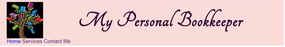

The header at the top of the page gives the company name and logo which conveys the intention of the site.

### Navigation Bar

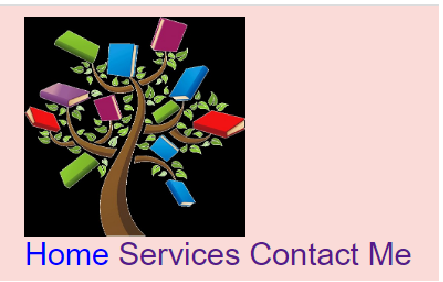

- This is located at the top of the page on the left under the logo.  It links to the home page, services page and contact us page.
- The navigation tool changes colour when hovered over and has a different colour when the site is on the active page.
- The names used for the navigation bar elements gives a clear indication of what is available on each page.
- The company name in the header, when clicked on will return the user to the home page.

### Launch Page/Home page

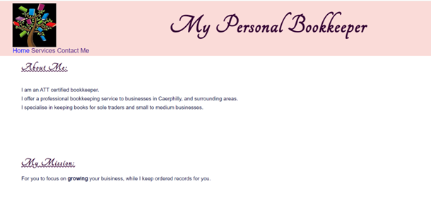

Gives a clear indication of the credential of the bookkeeper as well as the ethos behind the service offered.

### Services

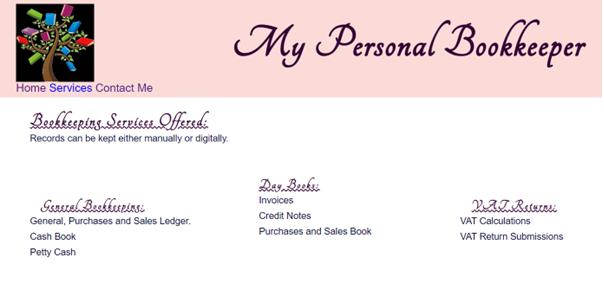

Clearly indicated the bookkeeping services that are available to the client.

### Contact Us

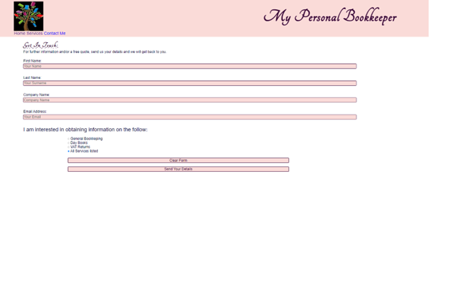

- Allows the user to submit details to obtain more information and/quote for the bookkeeping services that are available.
- Submissions won’t be accepted if required fields are filled or not filled in correctly.

### Follow us

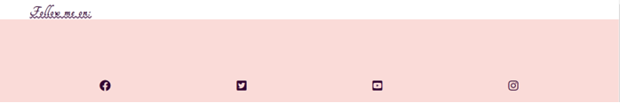

This section at the footer of each page gives the user the opportunity to glean more information about the company and the ethos of the company.
The follow us links will open in a new tab so that the user can still stay linked to company website.

### User experience
- A first-time user will get value from the site because the landing page gives a clear indication of what the site is for, and the navigation bar by their titles indicates what information is available on the pages of the site.  The follow me, will allow the first-time user to glean additional information about the business and the owner.

- Users returning to the site will also get value from the site because the layout is simple, navigation bar is easy to find, and they will be able to navigate quickly to the information they are searching for.

## Testing

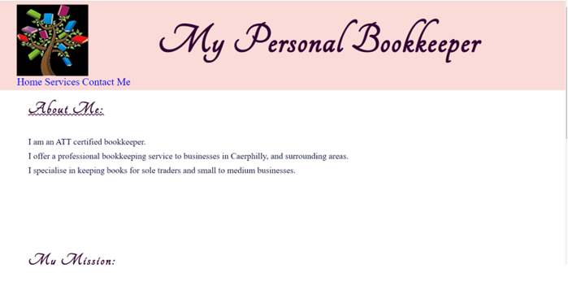
Page on laptop size.

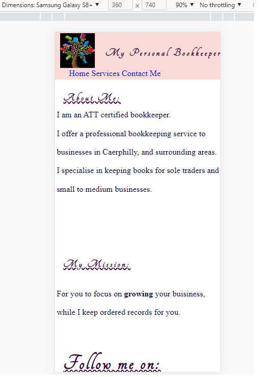
Same page mobile size.

- I tested the website on the chrome browser.
- I confirmed that the site was responsive, looked good and functioned on all standard screen sizes using devtools device toolbar.
- I confirmed that the form works, requires every field, and will only accept an email in email field.  I have left the form-dump link provided by my mentor as part of the form page to show that the data is collected correctly.

### Validator Testing
- HTML

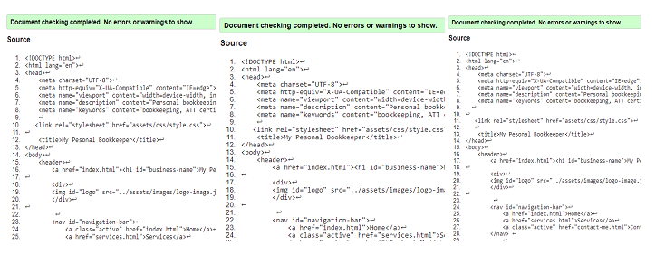

    - I ran the HTML code for each page through the official W3C validator.  I corrected the warning and errors indicated on each page until the code was validated.
- CSS

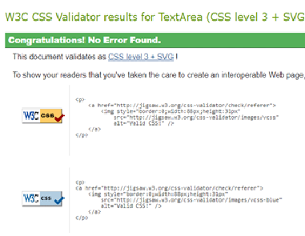

    - I ran the CSS code through the official W3C validator.  I corrected the warning and errors indicated on each page until the code was validated.

- Accessibility

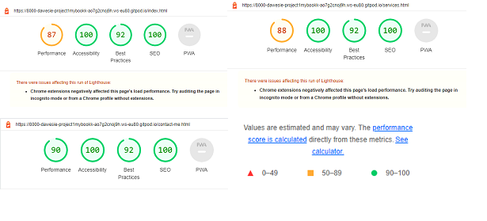

    - I checked each page’s accessibility using lighthouse in devtools.  Each page was shown to be accessible with respect colours and fonts used.

### Bugs
As I devloped the website, I fixed and corrected any bugs that I detected. 
To my knowledge there are no undetected bugs.

## Deployment
The site was deployed through GitHub as follows:
- In the GitHub repository, select project name, then navigate to “setting”, top right of the screen.
- Navigate to “pages” in the menu on the left-hand side of the screen, once in GitHub pages, select none under branch and save.
- This page will then provide a link to the website, listed below:

## Credits
### Content 
- The code to make the social media links was taken from C.I Love running project. https://learn.codeinstitute.net/courses/course-v1:CodeInstitute+LR101+2021_T1/courseware/4a07c57382724cfda5834497317f24d5/e6d4cda2bc08458ba94d2092be9bad3a/

-The Ural to upload data submitted was provided by my mentor using the C.I. link. 
 <form method="GET" action="https://formdump.codeinstitute.net/">

### Media
Logo was provided from a free download from clipartmax by Anndee Taylor- Book Tree https://www.clipartmax.com/download/m2H7N4m2A0K9K9A0_anndee-taylor-book-tree/

